## 높은 금액부터 보여주기(moneychart.c)
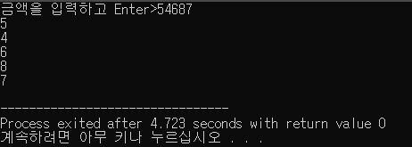

## 낮은 금액부터 보여주기(moneychart02.c)
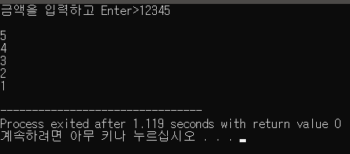

## 높은 금액과 낮음 금액 보여주기(moneychart03.c)
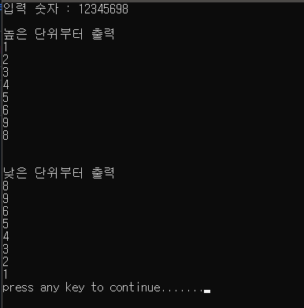

## 높은 단위 낮은 단위 출력 프로그램(numberpre01.c)
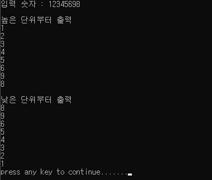

## 수직 수평 슬라이드바 만들기(slidebar01.c)

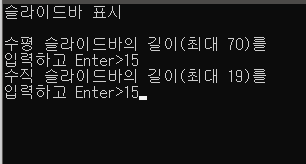 &nbsp;&nbsp; 
변경전
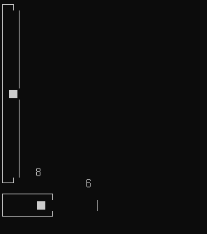
변경후
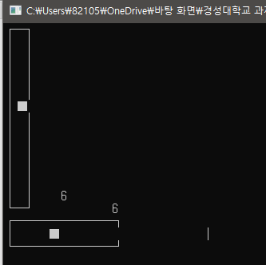
수직은 해결했지만 수평 바는 해결하지 못함

## 입력된 숫자 디지털 숫자로 보여주기(numberprint01.c)
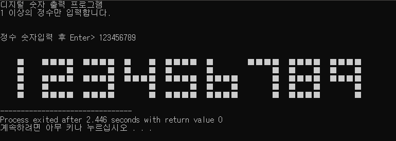

## 도형의 연속적 이동과 회전(movecotroll.c)
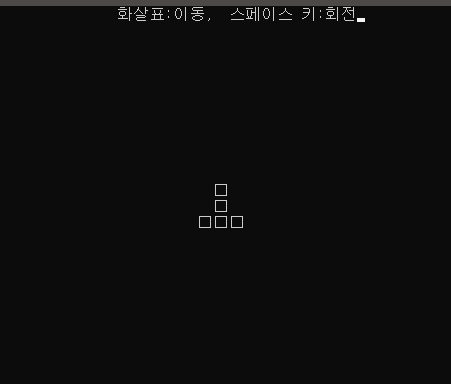 &nbsp;&nbsp;  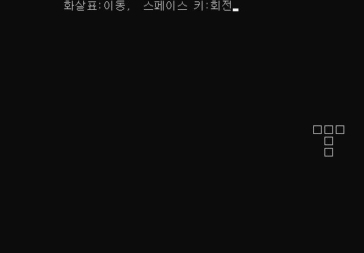 &nbsp;&nbsp;  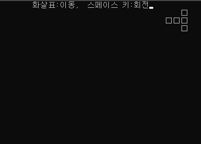
