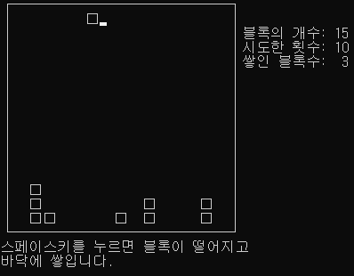

## Block Stack
###블록 쌓기 게임

##변경 전 문제점 1
  
  

수정 전 문제점 우측 a, b[2] 라인이 그려져야할 도형의 1/2 위치에서 그려짐

수정 후 반복문에서 여백으로 나올 공간의 반복 횟수를 *2+1 함

##문제점 변경 후 게임 플레이 화면

  

  
  

getch와 kbhit
kbhit 함수는 키보드의 입력 여부를 단순히 입력 버퍼만 확인하고 true랑 false값 리턴
단순히 버퍼만 확인하기 때문에 값이 입력되고 난 뒤 비우지 않으면 계속 ture값을 리턴함
getch 함수는 버퍼에 있는 값을 그대로 출력하고 버퍼를 비워줌

COORD Pos = {x - 1, y - 1}; //x와 y를 가지고 있는 구조 
SetConsoleCursorPosition(GetStdHandle(STD_OUTPUT_HANDLE), Pos); 
//콘솔의 위치를 알려주는 함수 
//get set handle = 화면출력 핸들러
